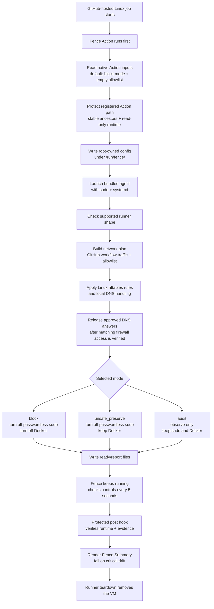

# Fence 🛡️

[](https://github.com/GrantBirki/fence/actions/workflows/lint.yml)
[](https://github.com/GrantBirki/fence/actions/workflows/test.yml)
[](https://github.com/GrantBirki/fence/actions/workflows/build.yml)
[](https://github.com/GrantBirki/fence/actions/workflows/acceptance.yml)
[](https://github.com/GrantBirki/fence/actions/workflows/action-acceptance.yml)
[](https://github.com/GrantBirki/fence/actions/workflows/integration.yml)

Fence runs first in a GitHub Actions job, allows only GitHub workflow traffic plus your `allowlist`, blocks other outbound network access, and turns off passwordless sudo and Docker by default.


## Quick Start ⚡

Add Fence as the first step in a supported GitHub-hosted Linux job:

```yaml
- uses: GrantBirki/fence@<commit-sha>
```

That one line starts Fence in `block` mode with an empty user `allowlist`.
Fence currently supports GitHub-hosted `ubuntu-24.04` x64 host jobs.

Choose `<commit-sha>` from the `action_commit` field in the release's `action-release.json` asset. The `main` branch is source-only and intentionally does not contain a runnable production bundle. Each release-specific `vX.Y.Z` tag points to a signed generated distribution commit containing the reviewed wrapper plus the exact validated agent bundle, but consumers should still pin that distribution commit's full 40-character SHA instead of the tag.

By default, Fence allows the GitHub domains needed for Actions job reporting.
It also allows `github.com`, `api.github.com`,
`release-assets.githubusercontent.com`, and the exact GitHub-hosted runner
watchdog endpoint so Fence can run before checkout and common setup steps
without suppressing runner health traffic. Fence does not make readiness depend
on that optional endpoint resolving before startup. Those allowed GitHub
domains are still places later workflow code can send data.

Before readiness, required exact hostnames retry only transient or addressless
DNS rounds, at most three attempts under one shared ten-second startup budget.
Malformed or integrity-invalid DNS responses are not retried. A valid zero-TTL
CNAME edge receives the same one-second minimum lifetime as a zero-TTL address.

GitHub uploads job logs and summaries to a per-run Azure storage account.
Fence authorizes at most four exact results-storage hostnames, and only when
the DNS request comes from the pinned GitHub runner process. It does not allow
the general `*.blob.core.windows.net` domain.

The hosted VM also depends on Azure platform services. The v5 profile permits only UID `0` host traffic to WireServer at `168.63.129.16` on TCP ports `80` and `32526`, separately from the user `allowlist` and GitHub workflow destinations. Unprivileged workflow traffic and forwarded container traffic do not match those rules. The profile also permits host and forwarded traffic to Azure IMDS at `169.254.169.254` on TCP `80`; no other IMDS port is allowed. Fixed upstream DNS traffic is classified against the current socket policy before generic established/related acceptance. The released Action enforces the same contract through its attested bundled agent.

## Examples 🧪

Run in audit mode first to see what would be blocked:

```yaml
- uses: GrantBirki/fence@<commit-sha>
  with:
    mode: audit
```

Allow a normal HTTPS hostname:

```yaml
- uses: GrantBirki/fence@<commit-sha>
  with:
    allowlist: |
      api.example.com
```

Allow a hostname on a custom TCP port:

```yaml
- uses: GrantBirki/fence@<commit-sha>
  with:
    allowlist: |
      registry.example.com:8443
```

Allow UDP or CIDR targets with the explicit line form:

```yaml
- uses: GrantBirki/fence@<commit-sha>
  with:
    allowlist: |
      udp://dns.example.com:53
      cidr 192.0.2.0/24 udp 123
      cidr 2001:db8::/64 tcp 443
```

Keep Docker/container access available while still locking down the network and
passwordless sudo, and lazily authorize one-label `docker.io` hostnames:

```yaml
- uses: GrantBirki/fence@<commit-sha>
  with:
    container_policy: unsafe_preserve
    allowlist: |
      *.docker.io
```

This pattern can authorize names such as `auth.docker.io` and
`registry-1.docker.io`. It does not guarantee a complete image pull because
layer, CDN, or storage traffic may use unrelated domains.

Disable the broad GitHub web/API/release-asset allowlist entries while keeping
the core GitHub Actions reporting path alive:

```yaml
- uses: GrantBirki/fence@<commit-sha>
  with:
    disable_broad_github_domains: true
```

Use raw JSON only when you need exact agent-schema control:

```yaml
- uses: GrantBirki/fence@<commit-sha>
  with:
    config: >-
      {"schema_version":1,"mode":"block","invocation_id":"my-job-1","allowlist":[]}
```

Most users should not set `invocation_id`. The Action generates one as
`fence-${GITHUB_RUN_ID}-${GITHUB_RUN_ATTEMPT}`. If you use raw JSON, set
`invocation_id` to a lowercase unique slug for that job run.

## Allowlist Lines 📝

The native `allowlist` input accepts one entry per line:

```text
example.com
example.com:8443
tcp://example.com:443
udp://dns.example.com:53
hostname example.com tcp 443
*.example.com
*.*.example.com
ip 192.0.2.10 tcp 443
cidr 192.0.2.0/24 udp 123
cidr 2001:db8::/64 tcp 443
```

Blank lines and lines starting with `#` are ignored. Hostname shortcuts default
to `tcp` port `443`. IPv6 or non-hostname entries should use the explicit
`ip` or `cidr` form.

Fence resolves exact hostname entries before lockdown is ready and refreshes
their approved addresses while the job runs. Each hostname keeps the protocol
and port you configured as DNS answers change.

The Action and agent accept exact-depth `*.example.com` and `*.*.example.com`
hostname patterns. Each `*` represents exactly one DNS label, and all user
patterns share an eight-name lifetime authorization budget. These names
materialize lazily after matching DNS queries and do not delay readiness.
Fence validates DNS structure rather than registrable-domain ownership, so use
broad or shared suffixes only as explicit egress and DNS-data-channel choices.
Derived DNS aliases are accepted only when every alias belongs to one acyclic
response chain rooted at the hostname that was queried. An unrelated alias or
address owner fails closed without creating later hostname authorization.

## How It Works 🔧

1. Your workflow starts with `uses: GrantBirki/fence@<commit-sha>`.
2. The Action protects its post-job code and bundled agent with a root-owned,
   read-only mount.
3. The Action writes a small root-owned config under `/run/fence/`.
4. The bundled Fence agent starts through `sudo` and `systemd`.
5. Fence checks the supported GitHub-hosted Linux shape, including fixed
   privileged executables, effective runner access to their paths and sudo
   policy, and the reviewed local root-control inventory.
6. In default `block` mode, Fence allows GitHub workflow traffic plus your
   `allowlist`, blocks other outbound network access, turns off passwordless
   sudo, and disables Docker/container access.
7. Fence keeps running until the runner is destroyed, rechecks the local
   root-control inventory with the other controls every five seconds, and
   records local evidence. Network findings may include bounded, best-effort
   local process attribution.
8. The protected post-job hook prints a compact **Fence Summary** with control
   results and observed network activity, then fails the job if Fence sees
   critical drift.



## Modes 🎛️

| Mode | What It Does | When To Use It |
| --- | --- | --- |
| `block` | Blocks network traffic outside GitHub workflow traffic and your `allowlist`; turns off passwordless sudo and Docker. | Default for locking down a job. |
| `block` with `container_policy: unsafe_preserve` | Blocks network traffic and turns off passwordless sudo, but leaves Docker/container access available. | When a workflow needs Docker and you accept the weaker security claim. |
| `audit` | Does not block traffic. Records what would need review before moving to `block`. | When tuning a workflow. |

## Security Notes 🔒

Fence reduces where later workflow steps can send data and removes common ways
to undo the lockdown. It is not a full sandbox, and it does not make a runner
perfectly hermetic.

The default GitHub allowlist is a usability tradeoff. It keeps normal GitHub
Actions reporting, checkout, API, and release-asset flows working, but later
workflow code can also send data to those allowed GitHub destinations. Set
`disable_broad_github_domains: true` if you want to remove `github.com`,
`api.github.com`, `release-assets.githubusercontent.com`, and the exact hosted
runner watchdog endpoint from the default allowlist. GitHub's exact
runner-authorized results-storage account also becomes a reachable destination
for the rest of the job; Fence records that authorization locally and limits it
to TCP port `443`.

Fence supports only GitHub-hosted `ubuntu-24.04` x64 host jobs today. The `ubuntu-latest` canary is useful signal, but it does not expand the support claim. A separate daily fixed-label canary fails on fingerprint drift or a skipped bundle activation and verifies the zero-input standard lifecycle on the supported runner. Pin Fence to the full immutable `action_commit` SHA reported by the release, not `@main` or a version tag.

## Release Provenance 🔏

A reviewed pull request containing the code change and `Cargo.toml`/`Cargo.lock` version bump is the only human release authorization. After that pull request merges, the release workflow treats the signed merge commit as source commit `M`, builds and attests the Linux x64 artifact from `M`, and creates a GitHub-signed child distribution commit `D` whose sole parent is `M`. The only files added by `D` are `action/bin/fence` and the schema-`4` `action/bundle-manifest.json`.

The release workflow runs the complete Action acceptance matrix and fixed-runner canary against `D` before publishing an immutable `vX.Y.Z` release whose tag targets `D`. The release's `action-release.json` asset maps the version, source commit `M`, distribution commit `D`, artifact digest, manifest schema, and release-workflow identity. Release assets remain attested to the reviewed source commit `M`; the generated commit records that source and signer digest without attempting to contain its own SHA.

Fence never downloads the agent or policy at Action runtime. The committed bundle bytes are checksum-validated, copied into the protected root-owned launcher directory with executable mode, and launched only from that protected copy. Releases through `v0.6.3` retain their historical tag semantics; the generated distribution-commit model applies beginning with the first later release.

Fence rejects activation when fixed privileged commands, their reviewed path ancestors, sudo-policy source identities, metadata, and exact accepted content digests, or the bounded root TCP/Unix and container inventory do not match the reviewed runner shape. Standard block permits only the expected removal of measured container-control state before readiness, then treats any later inventory change as critical drift. These checks rely on Fence running first on the trusted hosted image; they do not authenticate a command that was already modified by a compromised root or platform component before Fence started.

Fence does not upload telemetry. When it records a blocked or would-block
connection, it may add the local process ID, executable basename, actor class,
and up to four parent executable basenames. Process races or shared sockets can
produce `not_found` or `ambiguous` attribution. Fence never records command
arguments, full executable paths, environments, working directories, or packet
payloads.

## Troubleshooting 🧯

Fence prints a short progress log during setup and a compact **Fence Summary**
with control and network-activity tables at the end of the job. If setup fails
and you need more detail, enable the
standard GitHub Actions debug flag by setting the repository secret
`ACTIONS_STEP_DEBUG` to `true`. Debug logs include bounded service status and
Fence-specific diagnostics, but they avoid raw config bodies, environment
values, packet payloads, and unrelated system logs.

## Local Development ✈️

Fence follows the airplane-test model described in
[Hermetic Builds](https://software.birki.io/posts/hermetic-builds/). Prepare
toolchains deliberately, then run normal project commands from pinned vendored
inputs.

```console
script/prepare-rust
script/bootstrap
script/test
script/lint
script/build
```

`script/assemble-action-bundle` is the offline-only path for constructing a production-shaped Action tree from an explicit artifact, version, source SHA, and output root. It verifies those inputs and writes only below the requested output root; it does not fetch a release, agent, attestation, or policy. Pull-request validation uses this path to test an ephemeral candidate without adding generated bundle files to `main`.

Preparation downloads only the manifest, host components, and requested target
libraries named in the checked-in Rust distribution lock. Each download is
checksum-verified before rustup installs it from a temporary loopback-only
mirror. The fully qualified version-and-host toolchain is replaced only after
the complete selected artifact set verifies; caller-provided distribution and
update sources are not used, and rustup self-update is disabled.

## CLI 🧰

Most users should use the Action. The bundled Rust agent also exposes a narrow
JSON-only CLI:

```console
fence --version
fence check-support
fence render-plan --config policy.json
fence run --config /run/fence/example/config.json
```

Direct `fence run` is rejected unless it is launched through the trusted
Action/systemd path.

## Further Reading 📚

- [Fence v0 security contract](docs/v0.md)
- [Threat model](docs/threat-model.md)
- [Security policy](SECURITY.md)
- [Security review](docs/security-review.md)
- [Implementation history](docs/history.md)
- [Repository settings](docs/repository-settings.md)
- [Hermetic Builds](https://software.birki.io/posts/hermetic-builds/)

## License ⚖️

Fence is released under the [MIT License](LICENSE).
