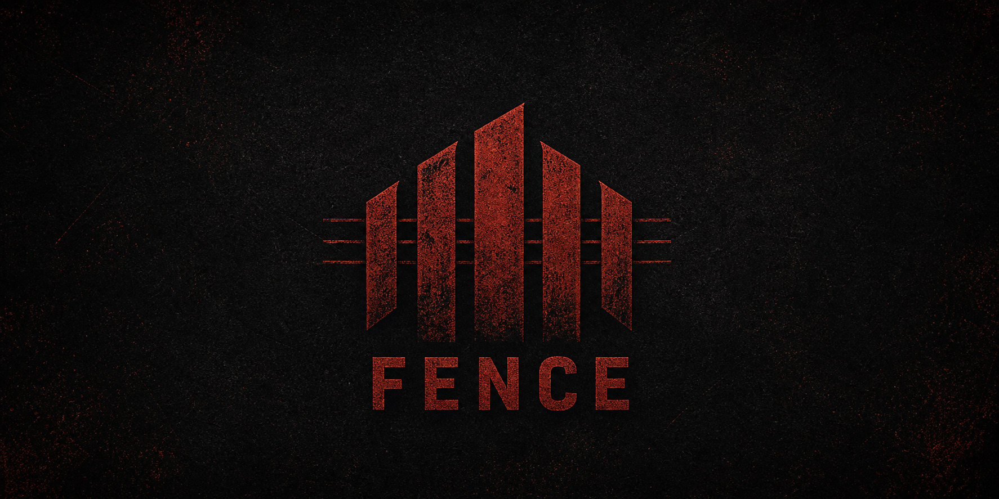
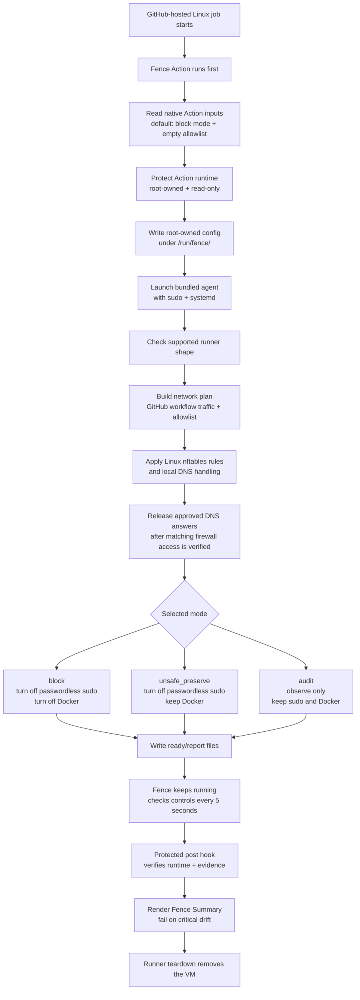

# Fence 🛡️

[](https://github.com/GrantBirki/fence/actions/workflows/lint.yml)
[](https://github.com/GrantBirki/fence/actions/workflows/test.yml)
[](https://github.com/GrantBirki/fence/actions/workflows/build.yml)
[](https://github.com/GrantBirki/fence/actions/workflows/acceptance.yml)
[](https://github.com/GrantBirki/fence/actions/workflows/action-acceptance.yml)
[](https://github.com/GrantBirki/fence/actions/workflows/integration.yml)

Fence runs first in a GitHub Actions job, allows only GitHub workflow traffic plus your `allowlist`, blocks other outbound network access, and turns off passwordless sudo and Docker by default.



## Quick Start ⚡

Add Fence as the first step in a supported GitHub-hosted Linux job:

```yaml
- uses: GrantBirki/fence@<commit-sha>
```

That one line starts Fence in `block` mode with an empty user `allowlist`.
Fence currently supports GitHub-hosted `ubuntu-24.04` x64 host jobs.

By default, Fence allows the GitHub domains needed for Actions job reporting.
It also allows `github.com`, `api.github.com`, and
`release-assets.githubusercontent.com` so Fence can run before checkout and
common setup steps. Those allowed GitHub domains are still places later
workflow code can send data.

## Examples 🧪

Run in audit mode first to see what would be blocked:

```yaml
- uses: GrantBirki/fence@<commit-sha>
  with:
    mode: audit
```

Allow a normal HTTPS hostname:

```yaml
- uses: GrantBirki/fence@<commit-sha>
  with:
    allowlist: |
      api.example.com
```

Allow a hostname on a custom TCP port:

```yaml
- uses: GrantBirki/fence@<commit-sha>
  with:
    allowlist: |
      registry.example.com:8443
```

Allow UDP or CIDR targets with the explicit line form:

```yaml
- uses: GrantBirki/fence@<commit-sha>
  with:
    allowlist: |
      udp://dns.example.com:53
      cidr 192.0.2.0/24 udp 123
      cidr 2001:db8::/64 tcp 443
```

Keep Docker/container access available while still locking down the network and
passwordless sudo:

```yaml
- uses: GrantBirki/fence@<commit-sha>
  with:
    container_policy: unsafe_preserve
```

Disable the broad GitHub web/API/release-asset allowlist entries while keeping
the core GitHub Actions reporting path alive:

```yaml
- uses: GrantBirki/fence@<commit-sha>
  with:
    disable_broad_github_domains: true
```

Use raw JSON only when you need exact agent-schema control:

```yaml
- uses: GrantBirki/fence@<commit-sha>
  with:
    config: >-
      {"schema_version":1,"mode":"block","invocation_id":"my-job-1","allowlist":[]}
```

Most users should not set `invocation_id`. The Action generates one as
`fence-${GITHUB_RUN_ID}-${GITHUB_RUN_ATTEMPT}`. If you use raw JSON, set
`invocation_id` to a lowercase unique slug for that job run.

## Allowlist Lines 📝

The native `allowlist` input accepts one entry per line:

```text
example.com
example.com:8443
tcp://example.com:443
udp://dns.example.com:53
hostname example.com tcp 443
ip 192.0.2.10 tcp 443
cidr 192.0.2.0/24 udp 123
cidr 2001:db8::/64 tcp 443
```

Blank lines and lines starting with `#` are ignored. Hostname shortcuts default
to `tcp` port `443`. IPv6 or non-hostname entries should use the explicit
`ip` or `cidr` form.

Fence resolves exact hostname entries before lockdown is ready and refreshes
their approved addresses while the job runs. Each hostname keeps the protocol
and port you configured as DNS answers change.

## How It Works 🔧

1. Your workflow starts with `uses: GrantBirki/fence@<commit-sha>`.
2. The Action protects its post-job code and bundled agent with a root-owned,
   read-only mount.
3. The Action writes a small root-owned config under `/run/fence/`.
4. The bundled Fence agent starts through `sudo` and `systemd`.
5. Fence checks that the runner matches the supported GitHub-hosted Linux shape.
6. In default `block` mode, Fence allows GitHub workflow traffic plus your
   `allowlist`, blocks other outbound network access, turns off passwordless
   sudo, and disables Docker/container access.
7. Fence keeps running until the runner is destroyed and records local evidence.
   Network findings may include bounded, best-effort local process attribution.
8. The protected post-job hook prints a compact **Fence Summary** with control
   results and observed network activity, then fails the job if Fence sees
   critical drift.



## Modes 🎛️

| Mode | What It Does | When To Use It |
| --- | --- | --- |
| `block` | Blocks network traffic outside GitHub workflow traffic and your `allowlist`; turns off passwordless sudo and Docker. | Default for locking down a job. |
| `block` with `container_policy: unsafe_preserve` | Blocks network traffic and turns off passwordless sudo, but leaves Docker/container access available. | When a workflow needs Docker and you accept the weaker security claim. |
| `audit` | Does not block traffic. Records what would need review before moving to `block`. | When tuning a workflow. |

## Security Notes 🔒

Fence reduces where later workflow steps can send data and removes common ways
to undo the lockdown. It is not a full sandbox, and it does not make a runner
perfectly hermetic.

The default GitHub allowlist is a usability tradeoff. It keeps normal GitHub
Actions reporting, checkout, API, and release-asset flows working, but later
workflow code can also send data to those allowed GitHub destinations. Set
`disable_broad_github_domains: true` if you want to remove `github.com`,
`api.github.com`, and `release-assets.githubusercontent.com` from the default
allowlist.

Fence supports only GitHub-hosted `ubuntu-24.04` x64 host jobs today. The
`ubuntu-latest` canary is useful signal, but it does not expand the support
claim. Pin Fence to a full immutable commit SHA, not `@main`.

Fence does not upload telemetry. When it records a blocked or would-block
connection, it may add the local process ID, executable basename, actor class,
and up to four parent executable basenames. Process races or shared sockets can
produce `not_found` or `ambiguous` attribution. Fence never records command
arguments, full executable paths, environments, working directories, or packet
payloads.

## Troubleshooting 🧯

Fence prints a short progress log during setup and a compact **Fence Summary**
with control and network-activity tables at the end of the job. If setup fails
and you need more detail, enable the
standard GitHub Actions debug flag by setting the repository secret
`ACTIONS_STEP_DEBUG` to `true`. Debug logs include bounded service status and
Fence-specific diagnostics, but they avoid raw config bodies, environment
values, packet payloads, and unrelated system logs.

## Local Development ✈️

Fence follows the airplane-test model described in
[Hermetic Builds](https://software.birki.io/posts/hermetic-builds/). Prepare
toolchains deliberately, then run normal project commands from pinned vendored
inputs.

```console
script/prepare-rust
script/bootstrap
script/test
script/lint
script/build
```

## CLI 🧰

Most users should use the Action. The bundled Rust agent also exposes a narrow
JSON-only CLI:

```console
fence --version
fence check-support
fence render-plan --config policy.json
fence run --config /run/fence/example/config.json
```

Direct `fence run` is rejected unless it is launched through the trusted
Action/systemd path.

## Further Reading 📚

- [Fence v0 security contract](docs/v0.md)
- [Threat model](docs/threat-model.md)
- [Security policy](SECURITY.md)
- [Security review](docs/security-review.md)
- [Implementation history](docs/history.md)
- [Repository settings](docs/repository-settings.md)
- [Hermetic Builds](https://software.birki.io/posts/hermetic-builds/)

## License ⚖️

Fence is released under the [MIT License](LICENSE).
