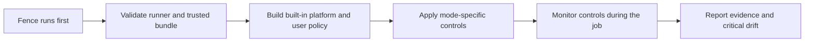

# Fence 🛡️

[](https://github.com/openai/fence/actions/workflows/lint.yml)
[](https://github.com/openai/fence/actions/workflows/test.yml)
[](https://github.com/openai/fence/actions/workflows/build.yml)
[](https://github.com/openai/fence/actions/workflows/acceptance.yml)
[](https://github.com/openai/fence/actions/workflows/action-acceptance.yml)
[](https://github.com/openai/fence/actions/workflows/action-drift-canary.yml?query=branch%3Amain+event%3Aschedule)
[](https://github.com/openai/fence/actions/workflows/action-acceptance-ubuntu-latest.yml?query=branch%3Amain+event%3Aschedule)
[](https://github.com/openai/fence/actions/workflows/integration.yml)

A GitHub Action for hardening CI/CD pipelines with bounded egress filtering and runner lockdown.


## Quick Start ⚡

Add Fence as the first step in a supported GitHub-hosted Linux job:

```yaml
- uses: openai/fence@<commit-sha> # pin@vX.Y.Z
```

This starts Fence in `block` mode with an empty user `allowlist` on a GitHub-hosted x64 job using `ubuntu-24.04` or `ubuntu-latest`. Replace `<commit-sha>` with the full `action_commit` value and `vX.Y.Z` with the tag from the same release; release notes provide the ready-to-copy line with a Dependabot-friendly `# pin@vX.Y.Z` comment. `main` is source-only and does not contain a runnable production bundle. Put Fence before checkout and any other steps you want it to constrain.

**Read more:** [Getting started with Fence](docs/getting-started.md)

## Examples 🧪

Start with a complete job that activates Fence before checkout:

```yaml
jobs:
  test:
    runs-on: ubuntu-24.04
    steps:
      - uses: openai/fence@<fence-commit-sha>
      - uses: actions/checkout@<checkout-commit-sha>
      - run: script/test
```

Run in audit mode first to see what would need review before enabling blocking:

```yaml
- uses: openai/fence@<commit-sha>
  with:
    mode: audit
```

The audit summary suggests allowlist entries for observed hostnames and direct IPv4 or IPv6 destinations.

Allow one or more HTTPS hostnames:

```yaml
- uses: openai/fence@<commit-sha>
  with:
    allowlist: |
      api.example.com
      artifacts.example.com
```

Allow custom TCP, UDP, or CIDR destinations:

```yaml
- uses: openai/fence@<commit-sha>
  with:
    allowlist: |
      registry.example.com:8443
      udp://dns.example.com:53
      cidr 192.0.2.0/24 udp 123
      cidr 2001:db8::/64 tcp 443
```

Keep Docker/container access available while still applying network restrictions and disabling passwordless sudo:

```yaml
- uses: openai/fence@<commit-sha>
  with:
    container_policy: unsafe_preserve
    allowlist: |
      *.docker.io
```

The wildcard can authorize exact-depth names such as `auth.docker.io`, but image pulls may require additional registry, layer, CDN, or storage destinations. Normal Docker container startup and cleanup remain supported in this degraded mode without weakening checks for genuinely reachable root-control changes.

Remove the broad GitHub web, API, release-asset, and watchdog destinations and new platform-origin `*.githubapp.com` authorizations while keeping the core Actions reporting path:

```yaml
- uses: openai/fence@<commit-sha>
  with:
    disable_broad_github_domains: true
```

Use raw JSON only when you need exact agent-schema control:

```yaml
- uses: openai/fence@<commit-sha>
  with:
    config: >-
      {"schema_version":1,"mode":"block","invocation_id":"my-job-1","allowlist":[]}
```

**Read more:** [Fence configuration examples](docs/examples.md)

## Allowlist Lines 📝

The native `allowlist` input accepts one destination per line:

```text
example.com
example.com:8443
tcp://example.com:443
udp://dns.example.com:53
hostname example.com tcp 443
*.example.com
*.*.example.com
ip 192.0.2.10 tcp 443
ip 2001:db8::10 udp 53
cidr 192.0.2.0/24 udp 123
cidr 2001:db8::/64 tcp 443
```

Hostname shortcuts use TCP port `443`; use the explicit `ip` or `cidr` form for address ranges and IPv6. CIDR entries must identify a network address without host bits. Fence accepts up to 64 unique, normalized allowlist entries; duplicate entries, blank lines, and comments beginning with `#` do not count more than once. Wildcards match exactly one or two leading labels and share a bounded lifetime authorization budget.

**Read more:** [Allowlist syntax and DNS behavior](docs/allowlist.md)

## How It Works 🔧

Fence validates that it is running through the supported Action path, turns your inputs into a local policy, and applies the controls for the selected mode. Local UDP and TCP DNS requests share the same tightly scoped root-only UDP resolver path. A resident agent keeps checking those controls throughout the job, and the protected post-job hook reports what happened and fails the job if it finds critical drift.



**Read more:** [Fence architecture and lifecycle](docs/how-it-works.md)

## Network Reports 📋

At the end of each job, Fence adds a readable network activity table to the GitHub job summary and the Fence post-job log. The log also includes one bounded, machine-readable `FENCE_REPORT_JSON=` record containing sanitized network decisions, control results, warnings, and suggested audit-mode allowlist entries.

Find the job and fetch its report through the GitHub API:

```bash
gh api repos/OWNER/REPO/actions/runs/RUN_ID/jobs \
  --jq '.jobs[] | {id, name}'

gh api repos/OWNER/REPO/actions/jobs/JOB_ID/logs \
  | sed -n 's/^.*FENCE_REPORT_JSON=//p' \
  | jq .
```

Job logs can be read by anyone with access to the workflow run. Reports include only bounded destination and approved actor information; they never include credentials, environment variables, request payloads, or full process paths.

**Read more:** [Network reports and lifecycle](docs/how-it-works.md#network-reports)

## Modes 🎛️

| Mode | What It Does | When To Use It |
| --- | --- | --- |
| `block` | Blocks network traffic unless it matches the bounded built-in GitHub Actions and hosted-runner platform policy or your `allowlist`; turns off passwordless sudo and Docker. | Default for locking down a job. |
| `block` with `container_policy: unsafe_preserve` | Blocks network traffic and turns off passwordless sudo, but leaves Docker/container access available. | When a workflow needs Docker and you accept the weaker security claim. |
| `audit` | Does not block traffic. Records what would need review before moving to `block`. | When tuning a workflow. |

**Read more:** [Fence assurance modes](docs/v0.md#assurance-modes)

## Security Notes 🔒

Fence adds a layer of protection to GitHub Actions jobs by limiting where later steps can send network traffic. Its default `block` mode also turns off passwordless `sudo` and Docker to make those protections harder to undo. Fence is not a complete sandbox, and allowed destinations remain reachable.

- **Supported runners:** GitHub-hosted x64 jobs using `ubuntu-24.04` or `ubuntu-latest`. Use `ubuntu-24.04` for the most predictable runner image; `ubuntu-latest` is also regularly tested but can change over time. Fence refuses to start if the runner does not pass its security checks.
- **Built-in connections:** Some GitHub and runner-platform connections remain open so the job can run and report results. Later steps can also reach those connections and destinations in your `allowlist`.
- **Tighter GitHub access:** Set `disable_broad_github_domains: true` when your workflow does not need optional GitHub destinations.
- **Audit mode:** Reports network activity without blocking it.
- **Docker access:** `container_policy: unsafe_preserve` keeps Docker available but provides weaker protection.
- **Release pinning:** Use the full, immutable `action_commit` SHA from a published release.

**Read more:** [Security boundaries and operational guidance](docs/security.md)

## Further Reading 📚

- [Getting started](docs/getting-started.md)
- [Configuration examples](docs/examples.md)
- [Allowlist syntax](docs/allowlist.md)
- [Architecture and lifecycle](docs/how-it-works.md)
- [Security boundaries](docs/security.md)
- [Release provenance](docs/release-provenance.md)
- [Troubleshooting](docs/troubleshooting.md)
- [Local development](docs/development.md)
- [CLI reference](docs/cli.md)
- [Fence v0 security contract](docs/v0.md)
- [Threat model](docs/threat-model.md)
- [Security policy](SECURITY.md)
- [Security review](docs/security-review.md)
- [Implementation history](docs/history.md)
- [Repository settings](docs/repository-settings.md)
- [Hermetic Builds](https://software.birki.io/posts/hermetic-builds/)

## License ⚖️

Fence is released under the [MIT License](LICENSE).
