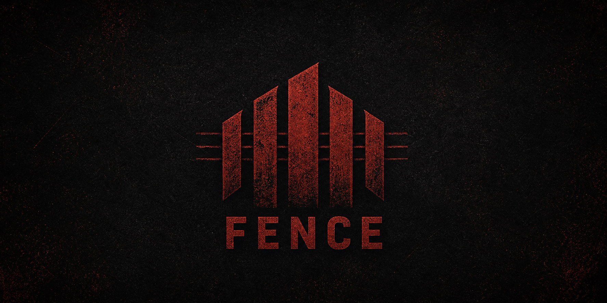

# Fence 🛡️

[](https://github.com/openai/fence/actions/workflows/lint.yml)
[](https://github.com/openai/fence/actions/workflows/test.yml)
[](https://github.com/openai/fence/actions/workflows/build.yml)
[](https://github.com/openai/fence/actions/workflows/acceptance.yml)
[](https://github.com/openai/fence/actions/workflows/action-acceptance.yml)
[](https://github.com/openai/fence/actions/workflows/action-drift-canary.yml?query=branch%3Amain+event%3Aschedule)
[](https://github.com/openai/fence/actions/workflows/action-acceptance-ubuntu-latest.yml?query=branch%3Amain+event%3Aschedule)
[](https://github.com/openai/fence/actions/workflows/integration.yml)

A GitHub Action for egress filtering and runner lockdown.



## Quick Start ⚡

Add Fence as the first step in a GitHub-hosted Linux job:

```yaml
jobs:
  test:
    runs-on: ubuntu-24.04
    steps:
      - uses: openai/fence@<commit-sha> # pin@vX.Y.Z
      - uses: actions/checkout@<checkout-commit-sha>
      - run: script/test
```

Copy the full commit SHA and version comment from the [latest release](https://github.com/openai/fence/releases). Fence supports GitHub-hosted `ubuntu-24.04` and `ubuntu-latest` x64 runners.

By default, Fence:

- Blocks outbound connections unless the hosted runner needs them or you allow them.
- Turns off passwordless `sudo`.
- Turns off Docker and container access.
- Reports network activity in the job summary and logs.

See [Getting started](docs/getting-started.md) for a complete example.

## Allow A Destination 📝

Add destinations your workflow needs to the `allowlist`:

```yaml
- uses: openai/fence@<commit-sha> # pin@vX.Y.Z
  with:
    allowlist: |
      api.example.com
      registry.example.com:8443
      udp://dns.example.com:53
      ip 192.0.2.10 tcp 443
      cidr 192.0.2.0/24 udp 123
```

Bare hostnames default to TCP port `443`. Fence also supports IPv6, custom ports, TCP, UDP, CIDR ranges, and one- or two-level hostname wildcards. An allowlist can contain up to 64 unique entries.

See [allowlist syntax](docs/allowlist.md) for all supported formats.

## Try Audit Mode 🔍

Not sure what your workflow needs? Start with audit mode:

```yaml
- uses: openai/fence@<commit-sha> # pin@vX.Y.Z
  with:
    mode: audit
```

Audit mode shows what Fence would block while leaving network, `sudo`, and Docker access available. It may still restore root ownership of `/etc` and `/usr`. Use the job summary to build your allowlist, then switch back to block mode.

## GitHub Artifacts And Pages 📦

Artifact uploads, GitHub Pages, and caches sometimes need access to storage endpoints used by GitHub Actions:

```yaml
- uses: openai/fence@<commit-sha> # pin@vX.Y.Z
  with:
    allow_github_artifacts: true
```

> [!IMPORTANT]
> This setting gives the job another way to send data off the runner. It is off by default; turn it on only when the job needs artifacts, Pages, or caches.

## Docker 🐳

Fence disables Docker by default. If your job needs containers, you can keep it available:

```yaml
- uses: openai/fence@<commit-sha> # pin@vX.Y.Z
  with:
    container_policy: unsafe_preserve
```

> [!WARNING]
> Docker access weakens runner isolation. Use `unsafe_preserve` only when the job needs containers.

## How It Works 🔧

Fence runs before the rest of your job and controls which network destinations the runner can reach:

1. It checks that the runner and bundled agent are supported.
2. It allows required GitHub and runner connections, plus your `allowlist`.
3. It blocks other outbound connections and turns off passwordless `sudo` and Docker.
4. It keeps those protections in place until the job ends.
5. It reports network activity and fails the job if its protections change unexpectedly.

See [how Fence works](docs/how-it-works.md) for more detail.

Fence briefly retries incomplete local service inspections before failing. If startup still fails, check the inspection reason codes in the log; see [troubleshooting](docs/troubleshooting.md#fence-fails-to-start).

Failed evidence validation may include [bounded, unverified diagnostics](docs/troubleshooting.md#post-job-evidence-validation-fails); the job still fails.

## Network Reports 📋

After evidence validation, Fence adds a network activity table to the job summary and post-job log. Each verified report also includes one `FENCE_REPORT_JSON=` line that you can fetch through the GitHub API:

```bash
gh api repos/OWNER/REPO/actions/runs/RUN_ID/jobs \
  --jq '.jobs[] | {id, name}'

gh api repos/OWNER/REPO/actions/jobs/JOB_ID/logs \
  | sed -n 's/^.*FENCE_REPORT_JSON=//p' \
  | jq .
```

The report includes network destinations, allowed or blocked activity, and warnings. A DNS warning can mean Fence safely refused an answer; it does not always mean protection failed. Audit reports also suggest allowlist entries. Anyone who can read the job log can read the report.

See [Network reports](docs/how-it-works.md#network-reports) for an example.

## Security Notes 🔒

Fence makes it harder for later workflow steps to send data to unexpected destinations or undo the runner's network restrictions. It is not a full sandbox.

- **Supported runners:** GitHub-hosted x64 jobs using `ubuntu-24.04` or `ubuntu-latest`. Fence checks the runner's security controls instead of rejecting routine image updates.
- **Built-in connections:** GitHub Actions, job reporting, and the hosted runner still need a small set of GitHub and Azure connections.
- **Azure platform:** Azure Instance Metadata Service remains reachable at `169.254.169.254:80`. Azure WireServer access is limited to root-owned host processes.
- **Artifacts:** `allow_github_artifacts: true` allows limited access to storage used by GitHub Actions.
- **Docker:** `unsafe_preserve` keeps containers available but reduces isolation.
- **Release pinning:** Use the full commit SHA from a published Fence release. Do not run the Action from `main`.

See the [security guide](docs/security.md) for more details.

## Development 🛠️

See [Local development](docs/development.md) for build and test instructions. Hosted CI allows a bounded wait for complete blocked-event evidence without changing enforcement or the protected-finalization deadline.

## Further Reading 📚

- [Getting started](docs/getting-started.md)
- [Configuration examples](docs/examples.md)
- [Allowlist syntax](docs/allowlist.md)
- [How Fence works](docs/how-it-works.md)
- [Security guide](docs/security.md)
- [Troubleshooting](docs/troubleshooting.md)
- [Release provenance](docs/release-provenance.md)
- [CLI reference](docs/cli.md)
- [Security policy](SECURITY.md)
- [Fence v0 specification](docs/v0.md)
- [Threat model](docs/threat-model.md)
- [Security review](docs/security-review.md)
- [Implementation history](docs/history.md)
- [Repository settings](docs/repository-settings.md)
- [Hermetic builds](https://software.birki.io/posts/hermetic-builds/)

## License ⚖️

Fence is released under the [MIT License](LICENSE).
