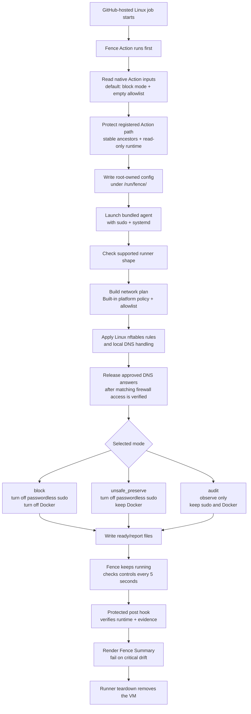

# Architecture And Lifecycle

Fence combines an immutable GitHub Action wrapper, a native Rust agent, local DNS mediation, Linux nftables policy, privilege and container controls, resident verification, and a protected post-job summary.

## Lifecycle

1. The workflow invokes the pinned Fence Action before checkout or other untrusted steps.
2. The wrapper validates its bundled manifest and protects the registered Action path with a root-owned read-only mount.
3. The wrapper validates native inputs, writes a root-owned configuration below `/run/fence/<invocation-id>/`, and launches the bundled agent as the main process of a matching transient systemd service.
4. The agent checks the supported GitHub-hosted runner fingerprint, including trusted executables and ancestors, sudo-policy sources, runner identity, and the bounded local root-control inventory.
5. The agent builds the selected profile and user policy, starts local DNS mediation, applies mode-specific nftables and privilege controls, and verifies the resulting state before writing readiness.
6. In block mode, approved DNS answers are released only after all corresponding firewall rules have been applied and structurally verified.
7. The agent remains resident and rechecks the firewall, privilege/container state, local-control inventory, worker health, and local evidence every five seconds. Critical resident health never returns to healthy.
8. The protected post-job hook validates the active service and evidence, writes the **Fence Summary**, prints bounded human-readable and machine-readable network reports, and fails the job when critical drift is present. Fence does not restore access; disposable runner teardown removes the VM.

## Detailed Flow



## Major Components

- **Action wrapper:** Converts the common native inputs into strict agent configuration, validates the bundled artifact, creates the protected launcher path, and registers the post-job hook.
- **Runtime intake:** Accepts only the expected root-owned, no-follow configuration path and matching transient service identity.
- **Platform profile:** Describes the supported runner fingerprint and the bounded GitHub Actions, Azure platform, DNS, sudo, container, and local-control expectations.
- **DNS mediator and firewall owner:** Attribute DNS requests, validate policy and response lineage, serialize firewall updates, and publish answers only after access is verified.
- **Resident verifier:** Rechecks controls and worker health every five seconds and records bounded local evidence.
- **Post-job hook:** Validates the live service and evidence, renders the final summary and bounded network reports, and converts critical findings into job failure.

## Network Reports

Fence automatically reports bounded network activity at the end of both `block` and `audit` jobs. The GitHub job summary remains the primary human-readable presentation. The post-job log also contains a short readable activity table followed by exactly one machine-readable line beginning with `FENCE_REPORT_JSON=`.

The JSON record uses stable `schema_version: 1` and includes the selected mode, `healthy`, `warning`, or `critical` result, final control states, at most 20 grouped network destinations, bounded warning and omission counters, and safe audit-mode allowlist recommendations. Its complete prefixed line is at most 16 KiB. Allowed DNS queries, rejected connections, and audit-mode `would_block` observations remain distinct; a DNS lookup does not claim that a network connection succeeded.

For example, an audit-mode report with one observed network destination is emitted as a single complete line:

```text
FENCE_REPORT_JSON={"schema_version":1,"mode":"audit","result":"healthy","controls":{"network":"verified","sudo":"preserved_verified","containers":"preserved_verified","protection_available":false,"readiness":"ready_observation_only","resident_health":"healthy"},"network":[{"destination_kind":"hostname","destination":"api.example.com","decision":"would_block","activities":[{"kind":"dns_query","query_type":"a","count":1},{"kind":"connection_attempt","protocol":"tcp","port":443,"count":2}],"actors":[{"label":"runner: curl (PID 4242)","count":2}],"count":3}],"warnings":{"critical_findings":0,"critical_codes":[],"materialization_rejections":0,"wildcard_rejections":0,"wildcard_authorizations_truncated":false,"results_storage_attribution_failures":0,"results_storage_rejections":0,"results_storage_authorizations_truncated":false},"omissions":{"network_rows":0,"hostname_recommendations":0,"ip_recommendations":0,"actor_entries":0,"activity_entries":0,"critical_codes":0,"unparsed_findings":0,"dns_evidence_missing":false,"source_truncated":false,"byte_budget_exceeded":false},"suggested_allowlist":["api.example.com"]}
```

List the jobs for a run:

```bash
gh api repos/OWNER/REPO/actions/runs/RUN_ID/jobs \
  --jq '.jobs[] | {id, name}'
```

Fetch and parse a job's final Fence report:

```bash
gh api repos/OWNER/REPO/actions/jobs/JOB_ID/logs \
  | sed -n 's/^.*FENCE_REPORT_JSON=//p' \
  | jq .
```

Fence writes this report only after checking the protected Action runtime, resident service, and local evidence. It writes verified critical results before intentionally failing the job, so diagnostics remain available without weakening the fail-closed behavior. Job logs expose validated hostnames, literal IP addresses, and bounded actor details to anyone who can read the workflow run. They never include raw reports, credentials, environment values, packet contents, process arguments, full executable paths, or remote telemetry.

The [Fence v0 specification](v0.md) is the normative behavior contract. The [threat model](threat-model.md) explains the trust boundaries and attacker assumptions.
