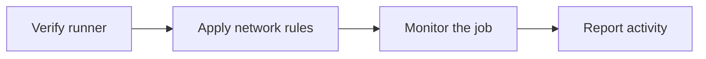

# How Fence Works 🔧

Fence runs first in a GitHub Actions job, limits outbound network access, and keeps checking those restrictions until the job ends. Its Rust agent is bundled with the Action.

## Job Lifecycle

1. Fence checks the runner and its bundled agent.
2. It allows the connections GitHub Actions needs, plus the destinations in your `allowlist`.
3. Block mode blocks other outbound connections and disables passwordless `sudo` and Docker.
4. The agent checks its protections throughout the job.
5. A final step reports network activity and fails the job if a protection changed unexpectedly.


```mermaid
flowchart LR
    start["Verify runner"] --> policy["Apply network rules"]
    policy --> monitor["Monitor the job"]
    monitor --> report["Report activity"]
```

Fence does not turn network or privilege access back on. GitHub discards the runner after the job ends.

## Block And Audit Modes

Block mode is the default. It allows the runner's required connections and your allowlisted destinations, blocks other network access, and disables passwordless `sudo` and Docker.

Audit mode shows what block mode would reject without blocking traffic or disabling `sudo` and Docker. Use it to find the destinations a job needs.

If a job needs Docker, use `container_policy: unsafe_preserve`. If it needs GitHub artifacts, Pages, or caches, use `allow_github_artifacts: true`. Both options make it easier for a job to send data or bypass isolation, so turn them on only when needed.

## Network Reports

Fence reports network activity in two places:

- The GitHub job summary shows a readable activity table.
- The post-job log includes the same activity and one machine-readable `FENCE_REPORT_JSON=` line.

The report lists allowed, blocked, or observed destinations, the status of Fence's protections, and any warnings. Audit reports also suggest allowlist entries. Reports include at most 20 destinations, stay under 16 KiB, and never contain secrets, environment variables, command arguments, or packet contents.

If Fence withholds a DNS answer, the warning explains why. The JSON report also includes fixed reason counts under `warnings.materialization_rejection_reasons`. An invalid reply, expired permission, or full queue does not by itself mean protection was lost. A failed firewall update is critical and fails the job.

### Fetch A Report

First, find the job ID:

```bash
gh api repos/OWNER/REPO/actions/runs/RUN_ID/jobs \
  --jq '.jobs[] | {id, name}'
```

Then extract and pretty-print the report:

```bash
gh api repos/OWNER/REPO/actions/jobs/JOB_ID/logs \
  | sed -n 's/^.*FENCE_REPORT_JSON=//p' \
  | jq .
```

Reports are retrievable only while the job log exists; GitHub applies a retention window to workflow logs, so consumers that need a durable record should capture the report when they observe it rather than re-fetching it later.

The job log stores the report on one line. `jq` formats it like this:

```json
{
  "schema_version": 1,
  "mode": "audit",
  "result": "healthy",
  "controls": {
    "network": "verified",
    "sudo": "preserved_verified",
    "containers": "preserved_verified",
    "protection_available": false,
    "readiness": "ready_observation_only",
    "resident_health": "healthy"
  },
  "network": [
    {
      "destination_kind": "hostname",
      "destination": "api.example.com",
      "decision": "would_block",
      "activities": [
        {
          "kind": "dns_query",
          "query_type": "a",
          "count": 1
        },
        {
          "kind": "connection_attempt",
          "protocol": "tcp",
          "port": 443,
          "count": 2
        }
      ],
      "actors": [
        {
          "label": "runner: curl (PID 4242)",
          "count": 2
        }
      ],
      "count": 3
    }
  ],
  "warnings": {
    "critical_findings": 0,
    "critical_codes": [],
    "materialization_rejections": 0,
    "materialization_rejection_reasons": {
      "invalid_response": 0,
      "authorization_changed": 0,
      "capacity": 0,
      "queue_unavailable": 0,
      "firewall_update_failed": 0
    },
    "wildcard_rejections": 0,
    "wildcard_authorizations_truncated": false,
    "results_storage_attribution_failures": 0,
    "results_storage_rejections": 0,
    "results_storage_authorizations_truncated": false,
    "github_artifact_uploads_enabled": false,
    "github_artifact_authorizations": 0
  },
  "omissions": {
    "network_rows": 0,
    "hostname_recommendations": 0,
    "ip_recommendations": 0,
    "actor_entries": 0,
    "activity_entries": 0,
    "critical_codes": 0,
    "unparsed_findings": 0,
    "dns_evidence_missing": false,
    "source_truncated": false,
    "byte_budget_exceeded": false
  },
  "suggested_allowlist": [
    "api.example.com"
  ]
}
```

Anyone who can read the job log can read this report. In audit mode, `would_block` means a request was observed but not denied. In block mode, blocking a request is normal and does not turn a healthy job into a warning.

For implementation details and the complete security contract, see the [v0 specification](v0.md), [threat model](threat-model.md), and [security guide](security.md).
