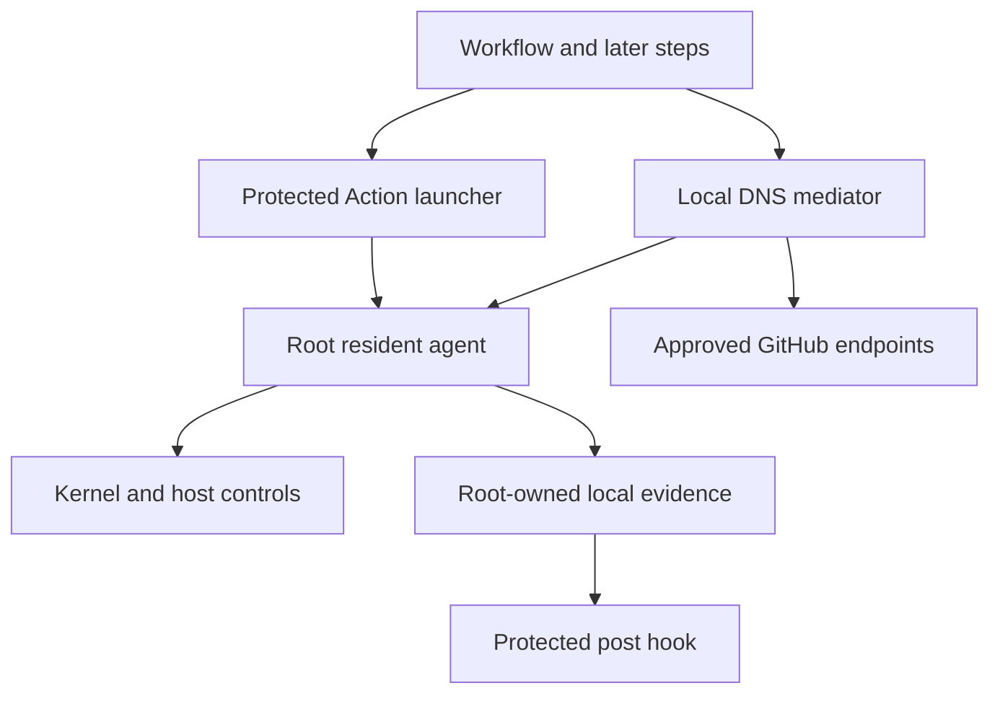

# Fence v0 Threat Model

Status: security-claim source for the v0 protected target
Audience: workflow authors, maintainers, adopters, and security reviewers
Last reviewed: 2026-06-11

This model must be reviewed before changing the supported runner class,
platform profile, trusted launcher, privilege controls, evidence trust model,
or public protection claims. Normative behavior and schemas remain in
[`v0.md`](v0.md); implementation chronology remains in
[`history.md`](history.md).

The source tree defines the schema-`5` policy and schema-`3` runtime-evidence
contract. A released Action bundle adopts that contract atomically by updating
its agent and wrapper validators together. The bundle remains
governed by `action/bundle-manifest.json` and the wrapper schema constants; the
wrapper rejects older evidence, stale verification state, an incomplete worker
set, or a resident PID that does not match the active systemd service. This
atomic contract is the critical-adoption gate for this model.

## Executive summary

Fence protects one narrow environment: a GitHub-hosted `ubuntu-24.04` x64 host
job in which Fence is the first workflow step. Its highest-risk boundaries are
the transition from runner-user code to the root resident agent, the exact
network policy realized from DNS, the privileged host controls that prevent
later bypass, and the local evidence consumed by the protected post hook. Fence
reduces arbitrary outbound access; it does not eliminate exfiltration because
approved GitHub destinations, DNS behavior, user allowlist entries, and shared
destination IP addresses remain usable channels.

## Scope and assumptions

In scope:

- the root GitHub Action wrapper and bundled Linux agent under `action/`;
- strict configuration, planning, DNS mediation, native `nftables`, NFLOG,
  lockdown, runtime storage, resident supervision, and local attribution under
  `src/`;
- protected-host validation in `.github/workflows/integration.yml` and
  `.github/workflows/action-acceptance.yml`;
- agent and Action-bundle provenance in `.github/workflows/release.yml`,
  `script/update-action-bundle`, and `script/validate-action-bundle`.

Assumptions that materially define the model:

- Fence runs before checkout, setup, or other untrusted workflow steps.
- The runner is an ephemeral GitHub-hosted `ubuntu-24.04` x64 host job that
  matches the reviewed fingerprint.
- Later workflow code may execute arbitrary commands as the unprivileged
  `runner` user and may possess workflow credentials or sensitive source.
- The Linux kernel, GitHub runner control plane, GitHub-hosted image supply
  chain, and GitHub Actions service are trusted.
- Standard block mode uses `container_policy: disable`; `unsafe_preserve` and
  `audit` have explicitly weaker claims.
- Fence has no remote control plane, telemetry upload, or runtime agent/policy
  download.

Out of scope:

- kernel, hypervisor, or GitHub platform compromise;
- self-hosted, long-lived, ARM, Windows, macOS, and job-container protection;
- semantic restrictions inside TLS or HTTP requests to approved endpoints;
- confidentiality from an endpoint intentionally placed in the user
  `allowlist`;
- preventing a malicious workflow from denying service to its own job; and
- guaranteed process ownership attribution or process isolation.

There are no unresolved context questions for the v0 risk ranking. Expanding
the supported runner class, allowing job containers, or changing the default
GitHub profile requires a new threat-model review.

## System model

### Primary components

- **Action launcher:** dependency-free TypeScript validates native inputs,
  creates root-owned launcher state, protects its registered runtime with a
  read-only bind mount, launches the service, and waits for readiness
  (`action/main.cts`, `action/lib.cts`).
- **Resident Rust agent:** validates the trusted service context and strict
  configuration, applies controls, emits readiness, supervises workers, and
  verifies state every five seconds (`src/cli.rs`, `src/lifecycle.rs`,
  `src/dns_mediator.rs`).
- **Network boundary:** a generated native `inet` ruleset, local DNS mediator,
  pinned `Runner.Worker` identity, and NFLOG reader implement and verify host egress policy
  (`src/nft.rs`, `src/nft_backend.rs`, `src/nflog.rs`).
- **Privilege boundary:** hosted-runner fingerprint checks, passwordless-sudo
  relocation, and Docker/containerd stop and runtime masking remove ordinary
  root-equivalent bypass paths (`src/hosted_runner.rs`, `src/lockdown.rs`).
- **Evidence boundary:** root-owned readiness and reports, resident health,
  bounded findings, and the protected post hook provide local evidence without
  restoring controls (`src/runtime.rs`, `src/findings.rs`, `action/post.cts`).
- **Publication boundary:** pinned offline inputs, release checksums, GitHub
  artifact attestations, and an attestation-verified bundle updater connect
  reviewed source to the committed Action binary
  (`.github/workflows/release.yml`, `script/update-action-bundle`).

### Data flows and trust boundaries

- **Workflow author -> Action launcher:** native inputs or bounded raw JSON
  cross through Action environment variables. The wrapper rejects conflicting
  input modes and constructs schema-`1` JSON; the agent performs strict
  unknown-field and semantic validation (`action/lib.cts`,
  `src/config.rs::parse_and_normalize`).
- **Runner user -> root launcher:** fixed `sudo` and `systemd-run` arguments
  launch one root service. Configuration and launcher files are copied to fixed
  root-owned paths; arbitrary executable paths and shell evaluation are not
  accepted (`action/main.cts`, `src/lifecycle.rs`).
- **Root agent -> Linux host controls:** fixed absolute commands and typed
  generated rules mutate only reviewed sudo, container, resolver, and owned
  `nftables` state. Subprocess output and execution time are bounded
  (`src/lockdown.rs`, `src/nft_backend.rs`, `src/dns_mediator.rs`).
- **Workflow process -> DNS mediator:** a reviewed read-only resolver mount
  sends host UDP/TCP DNS directly to Fence so caller sockets remain visible;
  Docker uses its separate local route. Block mode canonicalizes and forwards
  only authorized `A`/`AAAA` names; audit forwards observation traffic without a containment claim
  (`src/dns_mediator.rs`).
- **DNS mediator -> fixed resolver and firewall owner:** bounded queries go to
  the reviewed resolver path. An approved answer is withheld until all matching
  transport rules are applied and structurally verified
  (`src/dns_mediator.rs::MaterializationSubmitter`).
- **Pinned runner -> GitHub results storage:** Fence accepts a bounded exact
  results-storage name only when its host DNS socket belongs to the unique
  pinned `Runner.Worker` identity. The resulting HTTPS address grant is then
  available to other local code and remains an explicit residual channel
  (`src/attribution.rs::TrustedRunnerWorker`, `src/dns_mediator.rs`).
- **Kernel NFLOG -> resident agent:** group `4242` may copy at most 64 packet
  bytes. Fence immediately reduces this to endpoint metadata and drops raw
  bytes (`src/nflog.rs`, `src/findings.rs`).
- **Finding tuple -> attribution worker:** an internal source/destination tuple
  enters a queue of 128 requests. Bounded `/proc` snapshots return only a
  status, actor class, PID, executable basename, and four parent basenames;
  local endpoints are not serialized (`src/attribution.rs`).
- **Resident agent -> post hook:** root-owned `ready.json`, `report.json`, and
  `dns-report.json` are runner-readable but not runner-writable. For schema-`3`
  evidence, the post hook also verifies the live systemd PID and evidence
  freshness before trusting the report. Protected-mount and runtime-digest
  checks apply at the wrapper boundary, and all five supervised resident
  workers must remain healthy (`src/runtime.rs`, `action/post.cts`).
- **Release workflow -> committed Action bundle:** immutable release assets are
  checksum- and attestation-verified before the maintainer updater installs the
  binary and provenance manifest (`.github/workflows/release.yml`,
  `script/update-action-bundle`).

#### Diagram

## Assets and security objectives

| Asset | Why it matters | Security objective (C/I/A) |
| --- | --- | --- |
| Workflow credentials and tokens | Later steps may receive credentials capable of repository or release changes. | C, I |
| Checked-out source and build outputs | Exfiltration or modification can compromise proprietary source or published artifacts. | C, I |
| Effective network policy | A missing or broader rule changes the core protection claim. | I, A |
| Sudo and container lockdown | Either path can restore root-equivalent authority and bypass network controls. | I |
| Resident agent and protected Action runtime | Replacement can forge evidence, disable monitoring, or restore access. | I, A |
| Local readiness and report evidence | Operators and the post hook use it to decide whether the job remained protected. | I, A |
| Release agent and bundle provenance | A substituted binary compromises every adopting workflow. | I |
| Supported-host fingerprint | Silent runner-image drift can invalidate lockdown assumptions. | I |

## Attacker model

### Capabilities

- Run arbitrary native code as the later workflow's `runner` user.
- Read workflow-readable files, source, environment values, and credentials.
- Generate DNS and network traffic, including traffic to approved endpoints.
- Race local files and processes before readiness and attempt post-ready
  modification of runner-writable paths.
- Create high event volume within the fixed NFLOG, DNS, report, and attribution
  limits.
- Use passwordless sudo or Docker/containerd before Fence verifies their
  removal, or retain container access in explicit `unsafe_preserve` mode.

### Non-capabilities

- Compromise the Linux kernel, GitHub service, or reviewed hosted-runner image.
- Begin after Fence readiness with undisclosed root authority in standard block
  mode on a matching supported host.
- Modify root-owned runtime files, the protected read-only Action mount, or the
  bundled binary after successful readiness without exploiting a kernel or
  privileged-component vulnerability.
- Cause Fence to semantically inspect encrypted content sent to an approved
  destination.

## Entry points and attack surfaces

| Surface | How reached | Trust boundary | Notes | Evidence (repo path / symbol) |
| --- | --- | --- | --- | --- |
| Action native inputs | Workflow YAML | Author -> launcher | Bounded strings and multiline allowlist grammar; raw JSON is mutually exclusive. | `action/lib.cts::defaultInlineConfig` |
| Agent configuration | Root-owned config file | Launcher -> root agent | 256 KiB cap, strict schema, typed hostname/IP/CIDR and port validation. | `src/config.rs::read_config_bounded`, `parse_and_normalize` |
| Trusted service entry | `fence run --config` | Root process -> protected lifecycle | Requires root, fixed config path, matching systemd unit and MainPID. | `src/lifecycle.rs::validate_production_service_context` |
| Local DNS UDP/TCP | Host and Docker resolver traffic | Workflow process -> root mediator | Direct host resolver mount, separate Docker routing, canonical bounded queries, fixed listeners, deadlines, policy classification. | `src/dns_mediator.rs::start_dns_proxy` |
| Results-storage DNS | Exact GitHub storage hostname | Pinned runner -> root mediator | Unique `Runner.Worker` identity, socket ownership, strict grammar, four-account cap, HTTPS-only materialization. | `src/attribution.rs::TrustedRunnerWorker`, `src/dns_mediator.rs::matches_results_storage_hostname` |
| NFLOG netlink socket | Owned kernel log group | Kernel -> agent | Fixed group/prefix, 64-byte copy bound, duplicate/trailing attribute rejection. | `src/nflog.rs::extract_logged_prefix` |
| `/proc` attribution | Internal finding tuple | Agent -> kernel process metadata | Fixed queue and scan caps; ambiguous ownership is not guessed. | `src/attribution.rs::ProcAttributor` |
| `nft` subprocess | Generated program and structured state | Agent -> kernel firewall | Fixed binary/args, bounded IO/time, JSON verification, singleton owned table. | `src/nft_backend.rs::NativeNftBackend` |
| Sudo/container controls | Fixed files, units, and sockets | Agent -> host privilege state | Fingerprint-gated, narrow relocation/masking, pre-ready rollback only. | `src/lockdown.rs::SystemLockdownControl` |
| Runtime evidence files | Root writes, runner reads | Agent -> post hook | No-follow fixed paths, exclusive readiness, atomic reports, owner/mode checks. | `src/runtime.rs::ProductionRuntimeStore` |
| Protected post hook | GitHub post-job invocation | Runner -> evidence validator | Read-only mounted source, digest record, live PID and fresh report validation. | `action/post.cts::main` |
| Release and bundle update | Merge-triggered release and maintainer script | Source -> distributed binary | Pinned actions, protected environment, checksums, attestations, immutable tags. | `.github/workflows/release.yml`, `script/update-action-bundle` |

## Top abuse paths

1. **Exfiltrate through an approved channel:** malicious later code reads a
   token, sends it to an allowed GitHub or user allowlist destination, and the
   firewall permits it because Fence does not inspect TLS/HTTP semantics.
2. **Regain root and rewrite policy:** later code uses a residual sudo or
   container-control path, modifies `inet fence_v0`, and opens arbitrary
   egress. Fence prevents readiness unless the reviewed paths are disabled, but
   unrecognized hosted-image drift remains the key prerequisite.
3. **Exploit DNS authorization:** later code requests an allowed suffix or
   triggers a CNAME/address transition that broadens usable IP space, then
   sends data to another service sharing an authorized address. Fence bounds
   names, depth, TTL, and transports but cannot bind an IP to TLS identity.
4. **Race answer before firewall state:** a client attempts the first
   connection immediately after DNS resolution. Fence withholds the answer
   until the resident firewall owner applies and verifies the entire rule
   batch; queue rejection returns `SERVFAIL`.
5. **Replace the post hook:** later code overwrites the registered Action code
   so post-job validation reports success. Fence root-copies and bind-mounts
   the runtime read-only, then checks its digest and mount flags in post.
6. **Forge or replay evidence:** later code writes a false report or leaves a
   stale healthy file after killing the service. In the schema-`3` runtime
   contract, root ownership, active MainPID checks, worker health, monotonic
   verification sequence, and a 20-second freshness bound reject the evidence.
7. **Disable or alter firewall state after readiness:** later code or host drift
   removes an owned rule. Five-second structured verification records a
   critical finding; the post hook fails the job, but traffic during the
   verification window remains a residual risk.
8. **Substitute a release binary:** an attacker changes the bundled executable
   independently of reviewed source. The updater requires immutable release
   identity, checksum match, and GitHub build-provenance verification; offline
   CI revalidates the committed manifest and binary digest.
9. **Exhaust local evidence work:** later code floods DNS, NFLOG, or attribution
   paths. Fixed queues, sample rates, scan caps, finding caps, and report size
   bounds protect memory, but the attacker can still slow or fail its own job.
10. **Reuse an authorized results account:** after the pinned runner authorizes
    one exact storage account, later workflow code connects to the same resolved
    HTTPS addresses. Fence cannot determine whether an encrypted request carries
    a GitHub-issued signed URL, another valid credential, or unrelated data.

## Threat model table

| Threat ID | Threat source | Prerequisites | Threat action | Impact | Impacted assets | Existing controls (evidence) | Gaps | Recommended mitigations | Detection ideas | Likelihood | Impact severity | Priority |
| --- | --- | --- | --- | --- | --- | --- | --- | --- | --- | --- | --- | --- |
| TM-001 | Malicious workflow process | Residual root-equivalent path or unsupported host drift | Regain privilege and change firewall or agent state | Arbitrary egress and forged evidence | Credentials, policy, reports | Fingerprint gate and verified sudo/container lockdown (`src/hosted_runner.rs`, `src/lockdown.rs`) | New runner layouts can invalidate assumptions | Keep fail-closed fingerprint updates reviewable; add support only with hosted proof | Critical lockdown finding and support mismatch | Medium | High | High |
| TM-002 | Malicious workflow process | Access to an approved GitHub or user destination | Exfiltrate sensitive data through allowed HTTPS or DNS behavior | Credential/source disclosure | Credentials, source | Exact profile roots, opt-out for broad roots, typed allowlist, disclosed limits (`src/hostname_policy.rs`, `README.md`) | Core GitHub reporting and shared IPs remain channels | Continue narrowing the profile when hosted evidence permits; keep least-privilege job tokens | DNS/finding summary and audit-mode tuning | High | High | High |
| TM-003 | Malicious workflow process or DNS response | Authorized name, suffix, CNAME, or address rotation | Expand usable addresses or race first connection | Policy broadening or unexpected denial | Effective policy, job availability | Canonical A/AAAA queries, depth/name/TTL caps, completion-driven verified materialization (`src/dns_mediator.rs`) | IP authorization cannot prove TLS service identity | Preserve exact-host user policy; review suffix and CNAME bounds before expansion | DNS evidence counters, materialized allowances, critical backend findings | Medium | High | High |
| TM-004 | Malicious workflow process | Writable launcher/post/binary or evidence path | Replace validator or forge healthy evidence | False success after lost controls | Agent, post hook, reports | Root-owned copy, read-only bind mount, digests, no-follow files, and schema-`3` live PID/freshness checks (`action/main.cts`, `action/post.cts`, `src/runtime.rs`) | Kernel or privileged mount bypass is out of scope; resident verification remains periodic | Keep exact runtime manifest, worker set, freshness bounds, and hosted tamper tests | Post-hook integrity or freshness failure | Low | High | Medium |
| TM-005 | Local process or host drift | Ability to alter owned kernel state after readiness | Remove or replace firewall rules | Temporary or persistent unintended egress | Network policy | Exact structured state verification every five seconds and terminal critical health (`src/nft_backend.rs`, `src/dns_mediator.rs`) | Detection is periodic rather than instantaneous | Keep interval fixed and evaluate event-driven integrity only with bounded complexity | Critical drift finding; Action post failure | Medium | High | High |
| TM-006 | Workflow author or malicious config producer | Control of Action inputs before launcher validation | Inject paths, nft syntax, oversized policy, or ambiguous JSON | Privileged mutation or resource exhaustion | Host state, availability | Strict JSON, unknown-field rejection, fixed paths, typed entries, fixed limits (`action/lib.cts`, `src/config.rs`) | Raw JSON remains an advanced surface | Preserve schema-`1` strictness; add fields only through reviewed typed models | Structured pre-mutation setup failure | Low | High | Medium |
| TM-007 | Supply-chain attacker | Ability to alter a release asset, workflow dependency, or bundle refresh | Distribute an agent not built by the reviewed workflow | Fleet-wide compromise | Release agent, downstream workflows | SHA-pinned actions, protected release environment, checksums, attestations, offline bundle validation (`.github/workflows/release.yml`, `script/validate-action-bundle`) | Attestation trusts GitHub identity and workflow | Add SBOM and auditable/reproducible binary work as post-v0 hardening | Release verification job and bundle validation | Low | High | Medium |
| TM-008 | Malicious workflow process | Ability to generate local load | Saturate DNS, NFLOG, reports, or attribution scans | Job slowdown or failure | Job availability, evidence completeness | Queue/sample/query/scan/report caps and explicit truncation (`src/dns_mediator.rs`, `src/attribution.rs`, `src/findings.rs`) | Fence does not guarantee availability against later code | Keep limits non-configurable in v0; review CPU cost with real workloads | Warning counters, truncation, critical worker health | High | Medium | Medium |
| TM-009 | Local process race or namespace boundary | Socket disappears, is shared, or is outside the scanned namespace | Produce missing or ambiguous process attribution | Reduced incident context, not control bypass | Local evidence | Unique-owner requirement, bounded statuses, no guessing (`src/attribution.rs`) | Attribution is inherently best effort | Keep attribution advisory; do not gate containment on individual matches | `not_found`, `ambiguous`, and limit statuses | High | Low | Low |
| TM-010 | Malicious workflow process | A results-storage account was already authorized by the pinned runner | Reuse its resolved HTTPS address or a usable signed URL | Data exfiltration through a required GitHub channel | Credentials, source | Strict runner-bound authorization, exact grammar, four-account cap, TTL bounds, and explicit evidence (`src/attribution.rs`, `src/dns_mediator.rs`) | Fence cannot inspect TLS semantics or revoke per-request signed URLs | Keep the class provenance-bound and disclose it; never broaden to a storage wildcard | Authorized-account evidence and DNS counters | Medium | High | High |

## Criticality calibration

- **Critical:** a supported standard-block run reports healthy while arbitrary
  egress or a root bypass remains available; a published bundle is not the
  attested reviewed agent; or remote/untrusted input gains pre-readiness root
  code execution.
- **High:** an attacker can exfiltrate protected credentials through an
  unintended default channel, persistently disable controls, or forge post-job
  evidence with realistic runner-user capabilities.
- **Medium:** a bounded race creates temporary policy drift, a malicious step
  can reliably deny service to its own job, or a release/control weakness needs
  an additional privileged or platform prerequisite.
- **Low:** local attribution is missing or ambiguous, low-sensitivity metadata
  is exposed, or a noisy failure is already fail-closed and clearly reported.

Examples are context-dependent: an allowed GitHub channel is **high** residual
risk for a credential-bearing job, while attribution ambiguity is **low**
because attribution is not an enforcement input. Kernel compromise would be
**critical** in impact but is outside this threat model.

## Focus paths for security review

| Path | Why it matters | Related Threat IDs |
| --- | --- | --- |
| `action/main.cts` | Builds privileged launcher state, protects the runtime, and starts the root service. | TM-001, TM-004, TM-006 |
| `action/post.cts` | Converts local evidence and live service state into final job success or failure. | TM-004, TM-005 |
| `action/lib.cts` | Owns wrapper input parsing, path derivation, evidence validation, and summary sanitization. | TM-004, TM-006, TM-009 |
| `src/config.rs` | Defines the strict public policy parser and fixed input bounds. | TM-006 |
| `src/lifecycle.rs` | Enforces root/MainPID trusted-service identity and resident lifecycle rules. | TM-001, TM-004 |
| `src/runtime.rs` | Protects root-owned config, readiness, state, and report filesystem boundaries. | TM-004, TM-006 |
| `src/hostname_policy.rs` | Merges platform and user hostname transports into the logical policy. | TM-002, TM-003 |
| `src/dns_mediator.rs` | Implements DNS authorization, runner-bound results storage, refresh, materialization ordering, worker supervision, and reports. | TM-002, TM-003, TM-005, TM-008, TM-010 |
| `src/nft.rs` | Renders the deterministic owned firewall program and rule classes. | TM-001, TM-005 |
| `src/nft_backend.rs` | Applies and structurally verifies privileged kernel state through bounded subprocesses. | TM-001, TM-005 |
| `src/nflog.rs` | Parses the bounded kernel event wire format and rejects ambiguous attributes. | TM-008, TM-009 |
| `src/findings.rs` | Reduces packet prefixes to approved report metadata and keeps local tuples internal. | TM-008, TM-009 |
| `src/attribution.rs` | Scans bounded `/proc` state, pins `Runner.Worker`, attributes DNS sockets, and defines the local metadata privacy boundary. | TM-008, TM-009, TM-010 |
| `src/lockdown.rs` | Removes and verifies sudo and container bypass paths. | TM-001 |
| `.github/workflows/release.yml` | Connects reviewed source to immutable checksummed and attested release assets. | TM-007 |
| `script/update-action-bundle` | Installs the committed runtime binary only after release and attestation verification. | TM-007 |
